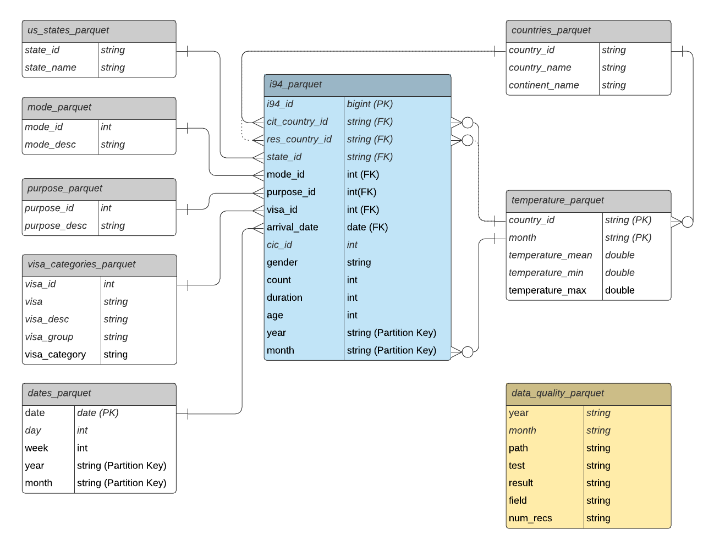

# Single Source of truth database for Cons&Analytics Inc.
### Data Engineering Capstone Project

#### Project Summary
The purpose of this project is to establish a single source of truth database around **I94 US immigration data** for a startup consulting company **Cons&Analytics Inc.** in the area of tourism and trade to provide insights about business opportunities arising from immigration.

A cloud based solution enables **data analysts** to faster implement customer specific use cases and gives **business consultants** a flexible database to answer analytical questions in day-to-day business revolving around trends in immigration patterns considering basic immigration profiles, purpose of travel, visa status and weather impacts.

The technologies used in this projects are **AWS S3, EMR , Glue, Athena and Apache Airflow**. Python, Pyspark and SQL are the main programming languages used to build the data pipeline for cleansing and loading the source data into the AWS S3 datalake.


#### Data


#### 1) I94 Immigration Data
This dataset came from the US National Tourism and Trade Office and documents daily arrivals of immigrants from countries all over the world into the US and additional information such as type of visa, mode of transportation, age groups, states visited (first intended address only), and the top ports of entry (for select countries). </br>
https://travel.trade.gov/research/reports/i94/historical/2016.html

- Note the full dataset is available in SAS data format by month (2016 Jan to Dec)

#### 2) Temperature Data
This dataset came from Kaggle and includes monthly average temperatures sind 1743 across the globe and therefore can be used to establish correlations between US immigration and weather trends. </br>
https://www.kaggle.com/berkeleyearth/climate-change-earth-surface-temperature-data


#### 3) Visa Categories
The immigration dataset contains a visatype (e. g. E1). A more detailed description about Visa Categories will allow for clearer insights of the purpose of the travel (in combination with the i94visa). The dataset is scrapped from the "Bureau Of Consulare Affairs" using Beautiful Soup.
</br>
https://travel.state.gov/content/travel/en/us-visas/visa-information-resources/all-visa-categories.html


#### 4) Countries and Continents
This dataset contains iso-codes for identification of countries and continents and is on the one hand a quality enrichment for drill-down possibilities of the I94 immigration data and allows for better drill-down opportunities.

https://datahub.io/JohnSnowLabs/country-and-continent-codes-list#resource-country-and-continent-codes-list-csv


### Data Model



- The Datamodel follows mostly a **STAR SCHEMA**
    - Dimension Tables:
        - countries
        - us_states
        - dates
        - mode
        - purpose
        - visa categories
    - Fact Tables:
        - i94
</br>
- The temperature table is implemented in **SNOWFLAKE** form

- Example Query:
    - Which continents/countries do people come from?
```python
"""
SELECT 
 co.continent_name
,co.country_name
,sum(count) as number_immigrants
FROM "model_db"."i94_parquet" im
LEFT OUTER JOIN "model_db"."countries_parquet" co
ON co.country_id = im.cit_country_id
GROUP BY
 co.continent_name
,co.country_name
order by co.continent_name, co.country_name
;
""";
```

### Architecture


- **Airflow is used to manage the execution and monitoring of the overall data pipeline**
    - A **monthly schedule** picks up the locally stored scripts (ETL and Data Quality) and moves the partially prepared data (see Data Transformation Details) from local Staging to the Amazon S3 Staging Bucket
    - The Airflow Dag spins up an Amazon EMR Cluster and executes the above mentioned scripts as steps:</br>
        **1) Staging to Model** - Extracts data from S3 (Staging), transforms and loads data into the SCHEMA implemented on S3 (Model) </br>
        **2) Data Quality** - Reads current dataload from S3 (Model), performs data quality tests and saves results in "data_quality_parquet" folder on S3 (Model)
    - The EMR Cluster is terminated automatically on success.
    - The AWS Glue Crawler is started to update the Athena Database schema to be ready for querying

#### Airflow


#### AWS S3 Datalake

```
etl-capstone
|-- athena/
|-- model/
|	|-- countries.parquet/
|	|-- data_quality.parquet/
|	|-- dates.parquet/
|	|-- i94.parquet/
|	|	|--2016/
|	|		|--01/
|	|		|--02/
|	|-- mode.parquet/
|	|-- purpose.parquet/
|	|-- states.parquet/
|	|-- visa_categories.parquet/
|-- staging/
|	|-- countries_mapping.csv
|	|-- countries.csv
|	|-- i94
|	|	|-- i94_2016-01_sub.sas7bdat
|	|	|-- i94_2016-02_sub.sas7bdat
|	|	|-- xxx.sas7bdat
|	|-- temperature.csv
|	|-- us_states.csv
|	|-- visa_categories.csv
|-- scripts/
	|-- etl-prod.py
	|-- dq-prod.py
```

### Installation

##### Pre-Requesites
- AWS Account
- AWS CLI 2 locally installed / credentials configured (accessed by docker-airflow)
- Docker
- python 3
- jupyter lab
- pandas
- pyspark
- pycountry
- beautiful soup

##### Steps to setup the Pipeline
- create aws bucket
- setup roles for EMR cluster
- run local ipynb scripts
- transfer files to s3 (or set load_sas = True)
- start docker airflow
- import config_variables to airflow
- create aws glue crawler**
- run dag

** to make use of the parquet-schema, the model needs to be loaded up to step "Staging to Model"

- run docker airflow

```docker-compose -f docker-compose-LocalExecutor.yml up -d```

- opitonal manual execution of ETL pipeline EMR cluster (ssh into cluster)

```/usr/bin/spark-submit --packages "saurfang:spark-sas7bdat:2.1.0-s_2.11" "s3://<bucket_name>/scripts/etl-prod.py" "<bucket_name>" "i94_2016-01_sub.sas7bdat"``` 

```/usr/bin/spark-submit "s3://<bucket_name>/scripts/dq-prod.py <bucket_name> 2016 1```

### Ressources

- https://github.com/puckel/docker-airflow
- https://programmaticponderings.com/2020/12/24/running-spark-jobs-on-amazon-emr-with-apache-airflow-using-the-new-amazon-managed-workflows-for-apache-airflow-amazon-mwaa-service-on-aws/
- https://www.startdataengineering.com/post/how-to-submit-spark-jobs-to-emr-cluster-from-airflow/
- https://stackoverflow.com/questions/52996591/wait-until-aws-glue-crawler-has-finished-running