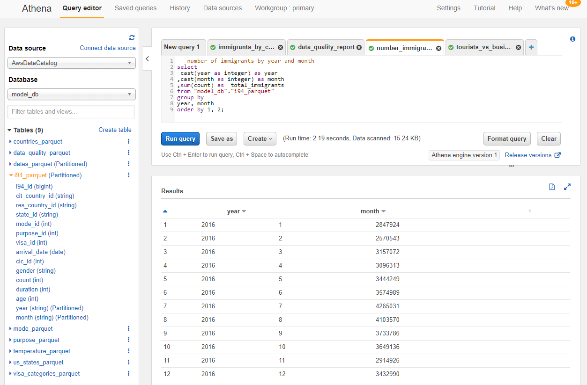

# Single Source of truth database for Cons&Analytics Inc.
### Data Engineering Capstone Project

#### Project Summary
The purpose of this project is to establish a single source of truth database around **I94 US immigration data** for a startup consulting company **Cons&Analytics Inc.** in the area of tourism and trade to provide insights about business opportunities arising from immigration.

A cloud based solution enables **data analysts** to faster implement customer specific use cases and gives **business consultants** a flexible database to answer analytical questions in day-to-day business revolving around trends in immigration patterns considering basic immigration profiles, purpose of travel, visa status and weather impacts.

The technologies used in this projects are **AWS S3, EMR , Glue, Athena and Apache Airflow**. Python, Pyspark and SQL are the main programming languages used to build the data pipeline for cleansing and loading the source data into the AWS S3 datalake.


The project follows the follow steps:
* Step 1: Scope the Project and Gather Data
* Step 2: Explore and Assess the Data
* Step 3: Define the Data Model
* Step 4: Run ETL to Model the Data
* Step 5: Complete Project Write Up


```python
# imports and installs
import pandas as pd
```

### Step 1: Scope the Project and Gather Data

#### Scope 
Explain what you plan to do in the project in more detail. What data do you use? What is your end solution look like? What tools did you use? etc>

This is the relevant scope:
- **Data understanding:**
    - Perform exploratory analysis
    - Understand business meaning of datasets
    - Identify data quality issues
    - Find potential new datasets for enrichment
    - Decide on scope of data
- **Data Architectur:**
    - Define single source of truth database providing </br>
        1) **data analysts** a data lake for advanced and individual customer use cases </br>
        2) **business consultants** a structured and flexible data model for day to day business analytics and consulting work </br>
    - Derive conceptual datamodel: Dimension and Fact tables
    - Decide on Technology
- **ETL-Pipeline:**
    - Define Cleansing & Loading Strategy:
        - Local cleansing vs cloud cleansing using EMR
        - Semi vs fully-automated dataloading using Airflow
        - Incremental vs Full Loading of Facts and Dimesions
        - Update cycle of data (e. g. monthly)
        - Decide on Technologies
    - Decide on Data Quality Measurements
        - Automated Tests e.g. using Record Counts, Null Counts
        - Unit tests e. g. test transformation functions
- **Develop and test the ETL pipeline**

#### Describe and Gather Data 
Describe the data sets you're using. Where did it come from? What type of information is included? 

#### 1) I94 Immigration Data
This dataset came from the US National Tourism and Trade Office and documents daily arrivals of immigrants from countries all over the world into the US and additional information such as type of visa, mode of transportation, age groups, states visited (first intended address only), and the top ports of entry (for select countries). </br>
https://travel.trade.gov/research/reports/i94/historical/2016.html


```python
# Load sample data
df = pd.read_csv('./data/immigration_data_sample.csv', index_col=[0])
df.head().T
```


<div>
<style scoped>
    .dataframe tbody tr th:only-of-type {
        vertical-align: middle;
    }

    .dataframe tbody tr th {
        vertical-align: top;
    }

    .dataframe thead th {
        text-align: right;
    }
</style>
<table border="1" class="dataframe">
  <thead>
    <tr style="text-align: right;">
      <th></th>
      <th>2027561</th>
      <th>2171295</th>
      <th>589494</th>
      <th>2631158</th>
      <th>3032257</th>
    </tr>
  </thead>
  <tbody>
    <tr>
      <th>cicid</th>
      <td>4084316.0</td>
      <td>4422636.0</td>
      <td>1195600.0</td>
      <td>5291768.0</td>
      <td>985523.0</td>
    </tr>
    <tr>
      <th>i94yr</th>
      <td>2016.0</td>
      <td>2016.0</td>
      <td>2016.0</td>
      <td>2016.0</td>
      <td>2016.0</td>
    </tr>
    <tr>
      <th>i94mon</th>
      <td>4.0</td>
      <td>4.0</td>
      <td>4.0</td>
      <td>4.0</td>
      <td>4.0</td>
    </tr>
    <tr>
      <th>i94cit</th>
      <td>209.0</td>
      <td>582.0</td>
      <td>148.0</td>
      <td>297.0</td>
      <td>111.0</td>
    </tr>
    <tr>
      <th>i94res</th>
      <td>209.0</td>
      <td>582.0</td>
      <td>112.0</td>
      <td>297.0</td>
      <td>111.0</td>
    </tr>
    <tr>
      <th>i94port</th>
      <td>HHW</td>
      <td>MCA</td>
      <td>OGG</td>
      <td>LOS</td>
      <td>CHM</td>
    </tr>
    <tr>
      <th>arrdate</th>
      <td>20566.0</td>
      <td>20567.0</td>
      <td>20551.0</td>
      <td>20572.0</td>
      <td>20550.0</td>
    </tr>
    <tr>
      <th>i94mode</th>
      <td>1.0</td>
      <td>1.0</td>
      <td>1.0</td>
      <td>1.0</td>
      <td>3.0</td>
    </tr>
    <tr>
      <th>i94addr</th>
      <td>HI</td>
      <td>TX</td>
      <td>FL</td>
      <td>CA</td>
      <td>NY</td>
    </tr>
    <tr>
      <th>depdate</th>
      <td>20573.0</td>
      <td>20568.0</td>
      <td>20571.0</td>
      <td>20581.0</td>
      <td>20553.0</td>
    </tr>
    <tr>
      <th>i94bir</th>
      <td>61.0</td>
      <td>26.0</td>
      <td>76.0</td>
      <td>25.0</td>
      <td>19.0</td>
    </tr>
    <tr>
      <th>i94visa</th>
      <td>2.0</td>
      <td>2.0</td>
      <td>2.0</td>
      <td>2.0</td>
      <td>2.0</td>
    </tr>
    <tr>
      <th>count</th>
      <td>1.0</td>
      <td>1.0</td>
      <td>1.0</td>
      <td>1.0</td>
      <td>1.0</td>
    </tr>
    <tr>
      <th>dtadfile</th>
      <td>20160422</td>
      <td>20160423</td>
      <td>20160407</td>
      <td>20160428</td>
      <td>20160406</td>
    </tr>
    <tr>
      <th>visapost</th>
      <td>NaN</td>
      <td>MTR</td>
      <td>NaN</td>
      <td>DOH</td>
      <td>NaN</td>
    </tr>
    <tr>
      <th>occup</th>
      <td>NaN</td>
      <td>NaN</td>
      <td>NaN</td>
      <td>NaN</td>
      <td>NaN</td>
    </tr>
    <tr>
      <th>entdepa</th>
      <td>G</td>
      <td>G</td>
      <td>G</td>
      <td>G</td>
      <td>Z</td>
    </tr>
    <tr>
      <th>entdepd</th>
      <td>O</td>
      <td>R</td>
      <td>O</td>
      <td>O</td>
      <td>K</td>
    </tr>
    <tr>
      <th>entdepu</th>
      <td>NaN</td>
      <td>NaN</td>
      <td>NaN</td>
      <td>NaN</td>
      <td>NaN</td>
    </tr>
    <tr>
      <th>matflag</th>
      <td>M</td>
      <td>M</td>
      <td>M</td>
      <td>M</td>
      <td>M</td>
    </tr>
    <tr>
      <th>biryear</th>
      <td>1955.0</td>
      <td>1990.0</td>
      <td>1940.0</td>
      <td>1991.0</td>
      <td>1997.0</td>
    </tr>
    <tr>
      <th>dtaddto</th>
      <td>07202016</td>
      <td>10222016</td>
      <td>07052016</td>
      <td>10272016</td>
      <td>07042016</td>
    </tr>
    <tr>
      <th>gender</th>
      <td>F</td>
      <td>M</td>
      <td>M</td>
      <td>M</td>
      <td>F</td>
    </tr>
    <tr>
      <th>insnum</th>
      <td>NaN</td>
      <td>NaN</td>
      <td>NaN</td>
      <td>NaN</td>
      <td>NaN</td>
    </tr>
    <tr>
      <th>airline</th>
      <td>JL</td>
      <td>*GA</td>
      <td>LH</td>
      <td>QR</td>
      <td>NaN</td>
    </tr>
    <tr>
      <th>admnum</th>
      <td>56582674633.0</td>
      <td>94361995930.0</td>
      <td>55780468433.0</td>
      <td>94789696030.0</td>
      <td>42322572633.0</td>
    </tr>
    <tr>
      <th>fltno</th>
      <td>00782</td>
      <td>XBLNG</td>
      <td>00464</td>
      <td>00739</td>
      <td>LAND</td>
    </tr>
    <tr>
      <th>visatype</th>
      <td>WT</td>
      <td>B2</td>
      <td>WT</td>
      <td>B2</td>
      <td>WT</td>
    </tr>
  </tbody>
</table>
</div>


- Note the full dataset is available in SAS data format by month (2016 Jan to Dec)
- Only the most relevant fields will be used

#### 2) Temperature Data
This dataset came from Kaggle and includes monthly average temperatures sind 1743 across the globe and therefore can be used to establish correlations between US immigration and weather trends. </br>
https://www.kaggle.com/berkeleyearth/climate-change-earth-surface-temperature-data


```python
# Load sample data
df_temp = pd.read_csv("./data/GlobalLandTemperaturesByCity.csv")
df_temp.head()
```


<div>
<style scoped>
    .dataframe tbody tr th:only-of-type {
        vertical-align: middle;
    }

    .dataframe tbody tr th {
        vertical-align: top;
    }

    .dataframe thead th {
        text-align: right;
    }
</style>
<table border="1" class="dataframe">
  <thead>
    <tr style="text-align: right;">
      <th></th>
      <th>dt</th>
      <th>AverageTemperature</th>
      <th>AverageTemperatureUncertainty</th>
      <th>City</th>
      <th>Country</th>
      <th>Latitude</th>
      <th>Longitude</th>
    </tr>
  </thead>
  <tbody>
    <tr>
      <th>0</th>
      <td>1743-11-01</td>
      <td>6.068</td>
      <td>1.737</td>
      <td>Århus</td>
      <td>Denmark</td>
      <td>57.05N</td>
      <td>10.33E</td>
    </tr>
    <tr>
      <th>1</th>
      <td>1743-12-01</td>
      <td>NaN</td>
      <td>NaN</td>
      <td>Århus</td>
      <td>Denmark</td>
      <td>57.05N</td>
      <td>10.33E</td>
    </tr>
    <tr>
      <th>2</th>
      <td>1744-01-01</td>
      <td>NaN</td>
      <td>NaN</td>
      <td>Århus</td>
      <td>Denmark</td>
      <td>57.05N</td>
      <td>10.33E</td>
    </tr>
    <tr>
      <th>3</th>
      <td>1744-02-01</td>
      <td>NaN</td>
      <td>NaN</td>
      <td>Århus</td>
      <td>Denmark</td>
      <td>57.05N</td>
      <td>10.33E</td>
    </tr>
    <tr>
      <th>4</th>
      <td>1744-03-01</td>
      <td>NaN</td>
      <td>NaN</td>
      <td>Århus</td>
      <td>Denmark</td>
      <td>57.05N</td>
      <td>10.33E</td>
    </tr>
  </tbody>
</table>
</div>


- the data used for the project is limited to the last 20 years of data and aggregated by country and month
- the detailed extraction and cleaning process is described in **temperature.ipynb**

#### 3) Visa Categories
The immigration dataset contains a visatype (e. g. E1). A more detailed description about Visa Categories will allow for clearer insights of the purpose of the travel (in combination with the i94visa). The dataset is scrapped from the "Bureau Of Consulare Affairs" using Beautiful Soup.
</br>
https://travel.state.gov/content/travel/en/us-visas/visa-information-resources/all-visa-categories.html

- this is a sample of the cleaned version
- the detailed extraction and cleaning process is described in **visa-categories.ipynb**


```python
df_visa = pd.read_csv("../staging/visa_categories.csv", sep=";")
df_visa.head()
```


<div>
<style scoped>
    .dataframe tbody tr th:only-of-type {
        vertical-align: middle;
    }

    .dataframe tbody tr th {
        vertical-align: top;
    }

    .dataframe thead th {
        text-align: right;
    }
</style>
<table border="1" class="dataframe">
  <thead>
    <tr style="text-align: right;">
      <th></th>
      <th>visa_category</th>
      <th>visa_group</th>
      <th>visa_desc</th>
      <th>visa</th>
      <th>visa_id</th>
    </tr>
  </thead>
  <tbody>
    <tr>
      <th>0</th>
      <td>Unknown Visa Categories</td>
      <td>Unknown Visa</td>
      <td>Unknown</td>
      <td>NaN</td>
      <td>1</td>
    </tr>
    <tr>
      <th>1</th>
      <td>Immigrant Visa Categories</td>
      <td>Immediate Relative &amp; Family Sponsored</td>
      <td>Spouse of a U.S. Citizen</td>
      <td>IR1</td>
      <td>2</td>
    </tr>
    <tr>
      <th>2</th>
      <td>Immigrant Visa Categories</td>
      <td>Immediate Relative &amp; Family Sponsored</td>
      <td>Spouse of a U.S. Citizen</td>
      <td>CR1</td>
      <td>3</td>
    </tr>
    <tr>
      <th>3</th>
      <td>Immigrant Visa Categories</td>
      <td>Immediate Relative &amp; Family Sponsored</td>
      <td>Spouse of a U.S. Citizen awaiting approval of ...</td>
      <td>K3</td>
      <td>4</td>
    </tr>
    <tr>
      <th>4</th>
      <td>Immigrant Visa Categories</td>
      <td>Immediate Relative &amp; Family Sponsored</td>
      <td>Fiancé(e) to marry U.S. Citizen &amp; live in U.S.</td>
      <td>K1</td>
      <td>5</td>
    </tr>
  </tbody>
</table>
</div>


#### 4) Countries and Continents
This dataset contains iso-codes for identification of countries and continents and is on the one hand a quality enrichment for drill-down possibilities of the I94 immigration data and allows for better drill-down opportunities.

https://datahub.io/JohnSnowLabs/country-and-continent-codes-list#resource-country-and-continent-codes-list-csv


```python
df_country = pd.read_csv("../staging/countries.csv", sep=";")
df_country.head()
```


<div>
<style scoped>
    .dataframe tbody tr th:only-of-type {
        vertical-align: middle;
    }

    .dataframe tbody tr th {
        vertical-align: top;
    }

    .dataframe thead th {
        text-align: right;
    }
</style>
<table border="1" class="dataframe">
  <thead>
    <tr style="text-align: right;">
      <th></th>
      <th>country_id</th>
      <th>country_name</th>
      <th>continent_name</th>
    </tr>
  </thead>
  <tbody>
    <tr>
      <th>0</th>
      <td>DZ</td>
      <td>Algeria, People's Democratic Republic of</td>
      <td>Africa</td>
    </tr>
    <tr>
      <th>1</th>
      <td>AO</td>
      <td>Angola, Republic of</td>
      <td>Africa</td>
    </tr>
    <tr>
      <th>2</th>
      <td>AO</td>
      <td>Angola, Republic of</td>
      <td>Africa</td>
    </tr>
    <tr>
      <th>3</th>
      <td>BJ</td>
      <td>Benin, Republic of</td>
      <td>Africa</td>
    </tr>
    <tr>
      <th>4</th>
      <td>BW</td>
      <td>Botswana, Republic of</td>
      <td>Africa</td>
    </tr>
  </tbody>
</table>
</div>


- this is a sample of the cleaned version
- the detailed extraction and cleaning process is described in **countries.ipynb**

### Step 2: Explore and Assess the Data
#### Explore the Data 
Identify data quality issues, like missing values, duplicate data, etc.

#### Cleaning Steps
Document steps necessary to clean the data

### Exploratorty Analysis and Cleansing Steps are documented in the following notebooks by dataset:
- i94-exploratory-analysis.ipynb
- temperature.ipynb 
- visa-categories.ipynb
- countries.ipynb

#### List of Analytical Questions derived from the exploratory analysis helping to establish the datamodel:

- How many people arrive at a given state in a given month / throughout the year?
- What is the purpose for arriving to the US (business or travel)?
- What is the age gender distribution of immigrants?
- Which continents/countries do people come from?
- What is the proportion of immigrants with US citizenship?
- What visa types are used frequently?
- How is wheater impacting the immigration numbers?
- How long are people staying on average in the US?
- Are most people arriving by air?
- Which is the first home address after arriving to the US?

### Step 3: Define the Data Model
#### 3.1 Conceptual Data Model
Map out the conceptual data model and explain why you chose that model


- The Datamodel follows mostly a **STAR SCHEMA**
    - Dimension Tables:
        - countries
        - us_states
        - dates
        - mode
        - purpose
        - visa categories
    - Fact Tables:
        - i94
</br>
- The temperature table is implemented in **SNOWFLAKE** form because
    - it has an optional relationship to i94 facts and
    - the country dimension can be directly used with the i94 facts when temperature information is irrelevant
</br></br>
- note that country_id can be used to join to cit_country_id as well to res_country_id (from countries and temperature) 
- data_quality is a separated table with data quality metadata in respect to the overall datamodel

- Benefits of the **STAR SCHEMA**
    - Simplifies Queries (less joins needed)
    - Fast Aggregation (e. g. sums, counts)
    - Easy to understand and query
</br></br>
- Benefits of the **SNOWFLAKE SCHEMA**
    - Needs less disk space (not a concern here)
    - Protection from data integrity issues
    - Easier to maintain

- The Datamodel is availabe in **AWS S3 (parquet) and can be directly queried via Athena**
- Example Query:
    - Which continents/countries do people come from?


```python
"""
SELECT 
 co.continent_name
,co.country_name
,sum(count) as number_immigrants
FROM "model_db"."i94_parquet" im
LEFT OUTER JOIN "model_db"."countries_parquet" co
ON co.country_id = im.cit_country_id
GROUP BY
 co.continent_name
,co.country_name
order by co.continent_name, co.country_name
;
""";
```

#### 3.2 Mapping Out Data Pipelines
List the steps necessary to pipeline the data into the chosen data model


- **Airflow is used to manage the execution and monitoring of the overall data pipeline**
    - A **monthly schedule** picks up the locally stored scripts (ETL and Data Quality) and moves the partially prepared data (see Data Transformation Details) from local Staging to the Amazon S3 Staging Bucket
    - The Airflow Dag spins up an Amazon EMR Cluster and executes the above mentioned scripts as steps:</br>
        **1) Staging to Model** - Extracts data from S3 (Staging), transforms and loads data into the SCHEMA implemented on S3 (Model) </br>
        **2) Data Quality** - Reads current dataload from S3 (Model), performs data quality tests and saves results in "data_quality_parquet" folder on S3 (Model)
    - The EMR Cluster is terminated automatically on success.
    - The AWS Glue Crawler is started to update the Athena Database schema to be ready for querying

- **Data Transformation Details**
    - Dimension tables ***countries***, ***us_states***, ***visa_categories*** and ***temperature*** are prepared locally using python pandas: 
        - the data is small and rather static (e. g. contintents / countries and related iso-codes will rarely change over time)
        - additionally, the cleansing of the visa categories is semi-automated due to the unstructured html-datasource and needs a visual examination before providing it to data consumers
        - the data is cleansed and stored locally in csv-file format
    - ***i94 immigration facts*** are transformed using AWS EMR and pyspark:
        - these monthly SAS files are rather large (~500MB per file) which makes local transformation inefficient and difficult
        - therefore the data is moved to S3 in its raw-form and transformed by the EMR cluster
    - ***data "ready-for-upload"*** to S3 staging is stored in the local ***staging folder***

- **Loading Stragegy**
    - Dimension tables:
        - ***countries***, ***us_states***, ***visa_categories*** </br> are overwritten with each (monthly) loading; even though a monthly update is not required, the data is uploaded along the i94 immigration data to ensure that potential updates are not missed
        - ***dates*** depends on the i94 immigration facts and therefore is appended monthly to the coressponding parquet folder partitioned by year/month
        - ***modes*** is defined in the etl-script and loaded with every run, previous data is overwritten
        - ***purpose*** is defined in the etl-script and loaded with every run, previous data is overwritten
        - ***temperature*** is overwritten with each (monthly) loading
    - Fact tables:
        - ***i94*** is monthly data and requires at most a monthly provisioning, therefore the data is appended monthly to the corresponding parquet folder partitioned by year/month

- **Data Consumption** </br>
    - Data Analysts can access the Datalake directly and enrich the data for customer specific use cases and build machine learning models e. g. predictive model considering temperature
    - Business Consultants will be enabled to access the data via Amazon Athena since it is very easy to use

### Step 4: Run Pipelines to Model the Data 
#### 4.1 Create the data model
Build the data pipelines to create the data model.

- Local transformation pipes are stored in folliwing scripts:
    - **countries.ipynb** outputs ***countries_mapping.csv***, ***countries.csv*** and ***us_states.csv*** to **local staging**
    - **visa-categories.ipynb** outputs ***visa_categories.csv*** to **local staging**
    - **temperature.ipynb** outputs ***temperature.csv*** to **local staging**

### Airflow Graph


- **spark_submit.py** contains the dag for the pipeline
- ***load_data to S3*** </br>
    - flag *load_sas*
        - False: i94 sas files must be uploaded to AWS S3 staging prior to starting the dag either
            - manually or 
            - with the script ***transfer-files-to-S3.py*** (recommended way)
        - True: picks up the file based of the airflow schedule (local docker environment/large filesize can cause timeouts)
    - *.csv files are always loaded
- **etl-prod.py** Staging to model Step 1
- **dq-prod.py** Data Quality Step 2

### Ariflow Gantt


### AWS Overview

- AWS S3 Datalake


- AWS S3 Staging


- AWS S3 I94


- AWS S3 Scripts


- AWS EMR Steps


- AWS S3 Model


- AWS S3 model i94


- AWS S3 i94 parquet files


- AWS Glue Crawler


- AWS Glue Tables


- AWS Athena Sample Query: Total number of immigrants in 2016 by month



- AWS Athena Sample Query: Tourists vs Business People from Germany to California/Florida by month


```python
"""
    with t1 as (
    SELECT 
     co.country_name
    ,st.state_name
    ,im.month
    ,round(tp.temperature_mean,1) as mean_temperature
    ,sum(case when pp.purpose_desc='Pleasure' then count else 0 end) as number_tourists
    ,sum(case when pp.purpose_desc='Business' then count else 0 end) as number_business
    ,sum(count) as number_immigrants
    FROM "model_db"."i94_parquet" im
    LEFT OUTER JOIN "model_db"."countries_parquet" co
    ON co.country_id = im.res_country_id
    LEFT OUTER JOIN "model_db"."us_states_parquet" st
    ON st.state_id = im.state_id
    LEFT OUTER JOIN "model_db"."purpose_parquet" pp
    ON pp.purpose_id = im.purpose_id
    LEFT OUTER JOIN "model_db"."temperature_parquet" tp
    ON tp.country_id = im.res_country_id
    and tp.month = im.month
    where 
        co.country_id = 'DE'
    and pp.purpose_desc in ('Business', 'Pleasure')
    and im.state_id in ('FL','CA')
    GROUP BY
     co.country_name
    ,im.month
    ,st.state_name
    ,tp.temperature_mean
    order by co.country_name, st.state_name, cast(im.month as integer)
    )
    select
     t1.country_name
    ,t1.state_name
    ,t1.month
    ,t1.mean_temperature
    ,t1.number_immigrants
    , round(cast(number_tourists as double) / cast(number_immigrants as double) *100,0) as rel_tourists
    , round(cast(number_business as double) / cast(number_immigrants as double) *100,0) as rel_business
    from t1
    ;
""";
```


- Percentage of tourists coming to Florida stays consistently at ~90% throughout the year
- Favorite visiting time to Florida is October and March, in this timeframe it is rather cold in Germany
- On the contrary, proportion of business travels to California is fluctuating between 11% and 53%
- August and September is busiest visiting time from Germany to California, tourists being the most

#### 4.2 Data Quality Checks
Explain the data quality checks you'll perform to ensure the pipeline ran as expected. These could include:
 * Integrity constraints on the relational database (e.g., unique key, data type, etc.)
 * Unit tests for the scripts to ensure they are doing the right thing
 * Source/Count checks to ensure completeness
 
Run Quality Checks

- Integrity is ensured by testing completeness of foreign key columns (no-nulls) although constraints are not enforced
- The final data model is checked whether it received records (record count > 0)
- A data quality report is created with each load which can be reviewed in more depth by a data engineer
- The data pipeline will fail if one of the data quality tests fails
- Cleansing steps are documented, tested and examined in the corresponding development scripts (folder dev)

- Athena data_quality report


#### 4.3 Data dictionary 
Create a data dictionary for your data model. For each field, provide a brief description of what the data is and where it came from. You can include the data dictionary in the notebook or in a separate file.


```python
pd.set_option('display.max_colwidth', 250)
df_dict = pd.read_csv("data-dict.csv", sep=";")
```


```python
df_dict
```


<div>
<style scoped>
    .dataframe tbody tr th:only-of-type {
        vertical-align: middle;
    }

    .dataframe tbody tr th {
        vertical-align: top;
    }

    .dataframe thead th {
        text-align: right;
    }
</style>
<table border="1" class="dataframe">
  <thead>
    <tr style="text-align: right;">
      <th></th>
      <th>Table</th>
      <th>Field</th>
      <th>Description</th>
    </tr>
  </thead>
  <tbody>
    <tr>
      <th>0</th>
      <td>i94</td>
      <td>i94_id</td>
      <td>monotonically increasing id used as a primary key</td>
    </tr>
    <tr>
      <th>1</th>
      <td>i94</td>
      <td>cit_country_id</td>
      <td>Country Codes (2-digit-ISO-Norm) represent the country of citizenship.</td>
    </tr>
    <tr>
      <th>2</th>
      <td>i94</td>
      <td>res_country_id</td>
      <td>Country Codes (2-digit-ISO-Norm) represent the country of residence.</td>
    </tr>
    <tr>
      <th>3</th>
      <td>i94</td>
      <td>state_id</td>
      <td>US-State Codes (2-digit), first address (state) after arrival</td>
    </tr>
    <tr>
      <th>4</th>
      <td>i94</td>
      <td>mode_id</td>
      <td>Arrival mode Integer see mode table</td>
    </tr>
    <tr>
      <th>5</th>
      <td>i94</td>
      <td>purpose_id</td>
      <td>Travel purpose Integer see purpose table</td>
    </tr>
    <tr>
      <th>6</th>
      <td>i94</td>
      <td>visa_id</td>
      <td>Type of Visa, Integer see visa_categories</td>
    </tr>
    <tr>
      <th>7</th>
      <td>i94</td>
      <td>arrival_date</td>
      <td>date of arrival to the US</td>
    </tr>
    <tr>
      <th>8</th>
      <td>i94</td>
      <td>cic_id</td>
      <td>Attribute: identifies the underlying immigration record</td>
    </tr>
    <tr>
      <th>9</th>
      <td>i94</td>
      <td>gender</td>
      <td>Attribute: M=Male, F=Female, U=Unknown</td>
    </tr>
    <tr>
      <th>10</th>
      <td>i94</td>
      <td>count</td>
      <td>Measure: Count of ariving persons</td>
    </tr>
    <tr>
      <th>11</th>
      <td>i94</td>
      <td>duration</td>
      <td>Measure: days staying in the US (departure_date - arrival_date)</td>
    </tr>
    <tr>
      <th>12</th>
      <td>i94</td>
      <td>age</td>
      <td>Age at point in time of the arrival</td>
    </tr>
    <tr>
      <th>13</th>
      <td>i94</td>
      <td>year</td>
      <td>Year of arrival</td>
    </tr>
    <tr>
      <th>14</th>
      <td>i94</td>
      <td>month</td>
      <td>Month of arrival</td>
    </tr>
    <tr>
      <th>15</th>
      <td>countries</td>
      <td>country_id</td>
      <td>Country Codes (2-digit-ISO-Norm)</td>
    </tr>
    <tr>
      <th>16</th>
      <td>countries</td>
      <td>country_name</td>
      <td>Name of the Country</td>
    </tr>
    <tr>
      <th>17</th>
      <td>countries</td>
      <td>continent_name</td>
      <td>Name of the Continent the Country belongs to</td>
    </tr>
    <tr>
      <th>18</th>
      <td>us_states</td>
      <td>state_id</td>
      <td>US-State code (2-digit)</td>
    </tr>
    <tr>
      <th>19</th>
      <td>us_states</td>
      <td>state_name</td>
      <td>US State Name</td>
    </tr>
    <tr>
      <th>20</th>
      <td>mode</td>
      <td>mode_id</td>
      <td>Arrival mode Integer</td>
    </tr>
    <tr>
      <th>21</th>
      <td>mode</td>
      <td>mode_desc</td>
      <td>Arrival mode description: Air, Land, Sea, Not Reported</td>
    </tr>
    <tr>
      <th>22</th>
      <td>purpose</td>
      <td>purpose_id</td>
      <td>Travel Purpose Integer</td>
    </tr>
    <tr>
      <th>23</th>
      <td>purpose</td>
      <td>purpose_desc</td>
      <td>Travel Purpose Description: Business, Pleasure, Student, Not Reported</td>
    </tr>
    <tr>
      <th>24</th>
      <td>visa_categories</td>
      <td>visa_id</td>
      <td>Visa type id Integer</td>
    </tr>
    <tr>
      <th>25</th>
      <td>visa_categories</td>
      <td>visa</td>
      <td>Visa Type (e. g. E1)</td>
    </tr>
    <tr>
      <th>26</th>
      <td>visa_categories</td>
      <td>visa_desc</td>
      <td>Description of the Type of Visa (e. g. Spouse of a U. S. Citizen)</td>
    </tr>
    <tr>
      <th>27</th>
      <td>visa_categories</td>
      <td>visa_group</td>
      <td>Describes a group of visa types (e. g. Immediate Relative &amp; Family Sponsored)</td>
    </tr>
    <tr>
      <th>28</th>
      <td>visa_categories</td>
      <td>visa_category</td>
      <td>Describes the visa category (e. g. Immigrant vs. Non Immigrant Visa)</td>
    </tr>
    <tr>
      <th>29</th>
      <td>temperature</td>
      <td>country_id</td>
      <td>Country Codes (2-digit-ISO-Norm)</td>
    </tr>
    <tr>
      <th>30</th>
      <td>temperature</td>
      <td>month</td>
      <td>month of a year (1, 2, …, 12)</td>
    </tr>
    <tr>
      <th>31</th>
      <td>temperature</td>
      <td>temperature_mean</td>
      <td>Average temperature of the Last 20 available years</td>
    </tr>
    <tr>
      <th>32</th>
      <td>temperature</td>
      <td>temperature_min</td>
      <td>Minimum temperature of the Last 20 available years</td>
    </tr>
    <tr>
      <th>33</th>
      <td>temperature</td>
      <td>temperature_max</td>
      <td>Maximum temperature of the last 20 available years</td>
    </tr>
    <tr>
      <th>34</th>
      <td>data_quality</td>
      <td>year</td>
      <td>reference year of the data (i94 year of arrival) associated with the data load</td>
    </tr>
    <tr>
      <th>35</th>
      <td>data_quality</td>
      <td>month</td>
      <td>reference month of the data (i94 month of arrival) associated with the data load</td>
    </tr>
    <tr>
      <th>36</th>
      <td>data_quality</td>
      <td>test</td>
      <td>has_rows, has_nulls</td>
    </tr>
    <tr>
      <th>37</th>
      <td>data_quality</td>
      <td>result</td>
      <td>passed or failed</td>
    </tr>
    <tr>
      <th>38</th>
      <td>data_quality</td>
      <td>field</td>
      <td>tested field if applicable</td>
    </tr>
    <tr>
      <th>39</th>
      <td>data_quality</td>
      <td>num_recs</td>
      <td>row count, null count of tests</td>
    </tr>
  </tbody>
</table>
</div>


#### Step 5: Complete Project Write Up
* Clearly state the rationale for the choice of tools and technologies for the project.
    - **Amazon Simple Storage Service (S3)** is storage for the Internet. It is designed to make web-scale computing easier for developers.
        </br>In this project S3 is used as a Datalake for the following reasons:
        - Scalability:
            - Once the demand for more storage increases, S3 can easily scale up at low cost rates
            - A huge upfront investment into local hardware and maintenance of the infrastructure would be a risk
            - Integration with other data (cloud-native) will be simple
            - Data can be archived if no longer needed "readily available" at even lower cost rates
        - Availability:
            - Data is available around the clock and accessible from anywhere, which is a huge benefit for business consultants meeting customers accross the US or are in homeoffice
        - Security:
            - Data is secured in the companies Virtual Private Cloud
            - Data can be encrypted if needed
        - Integration:
            - S3 Integrates easily with other AWS Services, e. g. EMR and Athena
            - Advanced services such as AWS Forecasting can easily access the data without the need for further data movement
    - **Amazon Elastic Map Reduce (EMR)** is a managed cluster platform that simplifies running big data frameworks, such as Apache Hadoop and Apache Spark
        - The Immigration SAS datafiles are rather huge (~500MB per file) and are at the core of the current datamodel
        - Since Apache Spark is designed to process huge amounts of data in parallel it is a perfect choice for the data transformation
        - The EMR Cluster is used very efficiently for that purpose, the cluster spins up once needed and turns down once the job is completed
        - This means it is very ressource efficient and therefore good for the environment and cost effective (since it is not running around the clock)
    - **Amazon Athena** is an interactive query service that makes it easy to analyze data directly in Amazon Simple Storage Service (Amazon S3) using standard SQL .
        - Integrates seamlessly with the S3 model bucket and parquet files
        - Since the parquet files provide already a schema (as defined in the transformation process) it can be re-used for Athena
        - A simple aws glue crawler can update Athena with new partitions once arrived
        - Athena uses native SQL and therefore on-demand queries can be executed without needing to maintain a separate infrastructure / advanced databases such as Redshift
        - Also ideal for a startup with a small number of users; cost and ressource efficient
    - **Apache Airflow** is an open-source workflow management platform.
        - Since Airflow monitors the overall pipeline it is not only ressource efficient it also secures the data quality
        - Scheduling capabilities lead to full automation of worfklows
        - Clear transparency which steps completed successfully and which not (easier debugging possible)
        - Graphical interface allows to understand the completion times of each task so that long running statements can be spotted and improved
       
</br>

* Propose how often the data should be updated and why.
    - The immigration data files cover a whole month of data therefore it is reasonable to update the datamodel once a month, this will help to stay on track for the latest developments on the immigration to discover trends
    - The dimension tables are partially static so an update is reasonable once major changes happen (see Data Transformation Details above)
* Write a description of how you would approach the problem differently under the following scenarios:
 * The data was increased by 100x.
       - AWS S3 will be able to handle the additional data with no effort.
       - The data is stored in a columnar file format (parquet) which has the benefit of fast data aggregations, so no change required.
       - The Apache Spark cluster is also scalable, it would be just a matter of adding additional ressources to the cluster.
       - Depending on the major use cases AWS Athena can still make sense. The data is partitioned by year and month and therefore does not need to read through all the data if e. g. analytics are based on the more recent data. 
 * The data populates a dashboard that must be updated on a daily basis by 7am every day.
    - Due to the use of Apache Airflow it is just a matter of re-scheduling the workflow. 
    - I generally would recommend to migrate the local Airflow solution to AWS as well. There is a relatively new managed service (MWAA) for that as well allowing for better scalability. 
    - A dashboard such as Tableau can be connected to Athena to feed the data.
 * The database needed to be accessed by 100+ people.
   - Athena would still work however it would make sense to build some data views which are specific to the use cases and to manage the access rights therewith. 
   - If there are many queries running against the database a better choice might be to replace Athena with a high end database which is permanenlty available (such as Redshift). 
   - The transition would be rather seamless in my point of view. It is just a matter of adding another task in the workflow which copies the data to redshift. 
   - This could be either done from the AWS EMR Cluster or from the AWS S3 datamodel. The Redshift Copy statment is very efficient and parquet is a supported file format.

### Folder Structure

##### Repository

```
etl-capstone
|-- dags
|	|-- config_variables.json
|	|-- dq-prod.py
|	|-- etl-prod.py
|	|-- job_flow_overrides.json
|	|-- spark_submit.py
|-- imgs
|-- plugins
|	|-- __init__.py
|	|-- operators
|		|-- __init__.py
|		|-- glue_crawler.py
|		|-- stage_s3.py
|-- scripts
|	|-- dev
|	|	|-- dq-dev.ipynb
|	|	|-- etl-dev.ipynb
|	|	|-- glue-crawler-dev.ipynb
|	|-- Capstone Project Template.ipynb
|	|-- countries.ipynb
|	|-- data-dict.csv
|	|-- i94-exploratory-analysis.ipynb
|	|-- temperature.ipynb
|	|-- transfer-files-to-S3.py
|	|-- visa-categories.ipynb
|-- staging (not available in git)
	|-- i94
	|	|-- i94_apr16_sub.sas7bdat
	|	|-- i94_aug16_sub.sas7bdat
	|	|-- xxx.sas7bdat
	|-- countries_mapping.csv
	|-- countries.csv
	|-- temperature.csv
	|-- us_states.csv
	|-- visa_categories.csv
```

##### AWS S3 Bucket

```
etl-capstone
|-- athena/
|-- model/
|	|-- countries.parquet/
|	|-- data_quality.parquet/
|	|-- dates.parquet/
|	|-- i94.parquet/
|	|	|--2016/
|	|		|--01/
|	|		|--02/
|	|-- mode.parquet/
|	|-- purpose.parquet/
|	|-- states.parquet/
|	|-- visa_categories.parquet/
|-- staging/
|	|-- countries_mapping.csv
|	|-- countries.csv
|	|-- i94
|	|	|-- i94_2016-01_sub.sas7bdat
|	|	|-- i94_2016-02_sub.sas7bdat
|	|	|-- xxx.sas7bdat
|	|-- temperature.csv
|	|-- us_states.csv
|	|-- visa_categories.csv
|-- scripts/
	|-- etl-prod.py
	|-- dq-prod.py
```

### Installation

##### Pre-Requesites
- AWS Account
- AWS CLI 2 locally installed / credentials configured (accessed by docker-airflow)
- Docker
- python 3
- jupyter lab
- pandas
- pyspark
- pycountry
- beautiful soup

##### Steps to setup Pipeline

- create aws bucket
- setup roles for EMR cluster
- run local ipynb scripts
- transfer files to s3 (or set load_sas = True)
- start docker airflow
- import config_variables to airflow
- create aws glue crawler**
- run dag

** to make use of the parquet-schema, the model needs to be loaded up to step "Staging to Model"

- run docker airflow

```docker-compose -f docker-compose-LocalExecutor.yml up -d```

- manual execution of ETL pipeline EMR cluster (ssh into cluster) for debugging

```/usr/bin/spark-submit --packages "saurfang:spark-sas7bdat:2.1.0-s_2.11" "s3://<bucket_name>/scripts/etl-prod.py" "<bucket_name>" "i94_2016-01_sub.sas7bdat"``` 

```/usr/bin/spark-submit "s3://<bucket_name>/scripts/dq-prod.py <bucket_name> 2016 1```

### Ressources

- https://github.com/puckel/docker-airflow
- https://programmaticponderings.com/2020/12/24/running-spark-jobs-on-amazon-emr-with-apache-airflow-using-the-new-amazon-managed-workflows-for-apache-airflow-amazon-mwaa-service-on-aws/
- https://www.startdataengineering.com/post/how-to-submit-spark-jobs-to-emr-cluster-from-airflow/
- https://stackoverflow.com/questions/52996591/wait-until-aws-glue-crawler-has-finished-running
